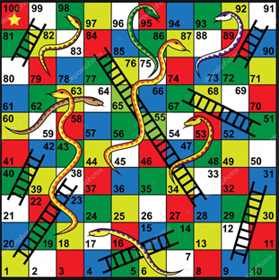
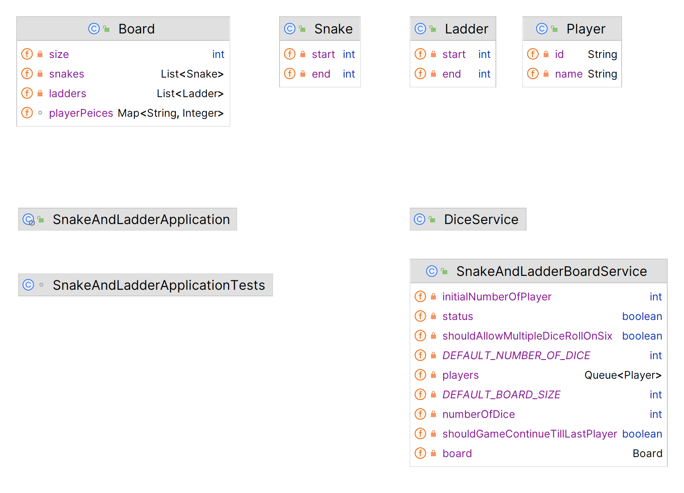

# Low Level Design - Snake And Ladder

### Introduction
This repository contains the low level design (LLD) implementation of a snake and ladder game

### Requirements & Setup

Requirements to run this program are :

- Java 17
- Maven 

### Running the application locally
- Clone this repository
- Run the application

### Problem Statement
- Create a snake and ladder application.

The application should take as input (from the command line or a file):

- Number of snakes (s) followed by s lines each containing 2 numbers denoting the head and tail positions of the snake.
- Number of ladders (l) followed by l lines each containing 2 numbers denoting the start and end positions of the ladder.
- Number of players (p) followed by p lines each containing a name.
- After taking these inputs, you should print all the moves in the form of the current player name followed by a random number between 1 to 6 denoting the die roll and the initial and final position based on the move.

      Format: <player_name> rolled a <dice_value> and moved from <initial_position> to <final_position>

- When someone wins the game, print that the player won the game.

      Format: <player_name> wins the game

### Rules of the game
- The board will have 100 cells numbered from 1 to 100.
- The game will have a six sided dice numbered from 1 to 6 and will always give a random number on rolling it.
- Each player has a piece which is initially kept outside the board (i.e., at position 0).
- Each player rolls the dice when their turn comes.
- Based on the dice value, the player moves their piece forward that number of cells. Ex: If the dice value is 5 and the piece is at position 21, the player will put their piece at position 26 now (21+5).
- A player wins if it exactly reaches the position 100 and the game ends there.
- After the dice roll, if a piece is supposed to move outside position 100, it does not move.
- The board also contains some snakes and ladders.
- Each snake will have its head at some number and its tail at a smaller number.
- Whenever a piece ends up at a position with the head of the snake, the piece should go down to the position of the tail of that snake.
- Each ladder will have its start position at some number and end position at a larger number.
- Whenever a piece ends up at a position with the start of the ladder, the piece should go up to the position of the end of that ladder.
- There could be another snake/ladder at the tail of the snake or the end position of the ladder and the piece should go up/down accordingly.

### Assumptions you can take apart from those already mentioned in rules

- There won’t be a snake at 100.
- There won’t be multiple snakes/ladders at the same start/head point.
- It is possible to reach 100, i.e., it is possible to win the game.
- Snakes and Ladders do not form an infinite loop.

### Optional Requirements

Please do these only if you’ve time left. You can write your code such that these could be accommodated without changing your code much.
- The game is played with two dice instead of 1 and so the total dice value could be between 2 to 12 in a single move. 
- The board size can be customizable and can be taken as input before other input (snakes, ladders, players). 
- In case of more than 2 players, the game continues until only one player is left. 
- On getting a 6, you get another turn and on getting 3 consecutive 6s, all the three of those get cancelled. 
- On starting the application, the snakes and ladders should be created programmatically without any user input, keeping in mind the constraints mentioned in rules.

### Requirement 
[Link](https://workat.tech/machine-coding/editorial/how-to-design-snake-and-ladder-machine-coding-ehskk9c40x2w)
1. Here we create a board of size 10 and dice of side 6. 
2. Each player puts their counter on the board at starting position at 1 and takes turns to roll the dice. 
3. Move your counter forward the number of spaces shown on the dice. 
4. If your counter lands at the bottom of a ladder, you can move up to the top of the ladder. If your counter lands on the head of a snake, you must slide down to the bottom of the snake. 
5. Each player will get a fair chance to roll the dice. 
6. On the dice result of 6, the user gets one more chance to roll the dice again. However, the same user can throw the dice a maximum of 3 times.
Note: if the result of the dice is 6,6,6 the user can not throw the dice again as the maximum attempts are over and the next user will get to throw the dice. 
7. When the user rolls dice and it leads to an invalid move, the player should remain in the same position.
Ex: when the user is in position 99 and rolling of dice yields any number more than one the user remains in the same position. 
8. Print the ranks of users who finished first, second, and so on…

### Class Diagram

### Output

    Enter number of snakes
    2
    Enter snake start and end
    77 6
    Enter snake start and end
    56 15
    Enter number of ladder
    2
    Enter ladder start and end
    11 93
    Enter ladder start and end
    44 64
    Enter number of player
    2
    Enter name of Player 1
    Ruchita
    Enter name of Player 2
    Pragati
    Player : Ruchita rolled a position : 1 to new position : 1
    Player : Pragati rolled a position : 1 to new position : 1
    Player : Ruchita rolled a position : 2 to new position : 3
    Player : Pragati rolled a position : 1 to new position : 2
    Player : Ruchita rolled a position : 2 to new position : 5
    Player : Pragati rolled a position : 4 to new position : 6
    Player : Ruchita rolled a position : 6 to new position : 93
    Player : Pragati rolled a position : 2 to new position : 8
    Player : Ruchita rolled a position : 4 to new position : 97
    Player : Pragati rolled a position : 3 to new position : 93
    Player : Ruchita rolled a position : 5 to new position : 97
    Player : Pragati rolled a position : 3 to new position : 96
    Player : Ruchita rolled a position : 1 to new position : 98
    Player : Pragati rolled a position : 5 to new position : 96
    Player : Ruchita rolled a position : 1 to new position : 99
    Player : Pragati rolled a position : 4 to new position : 100
    Player: Pragati has won the game

